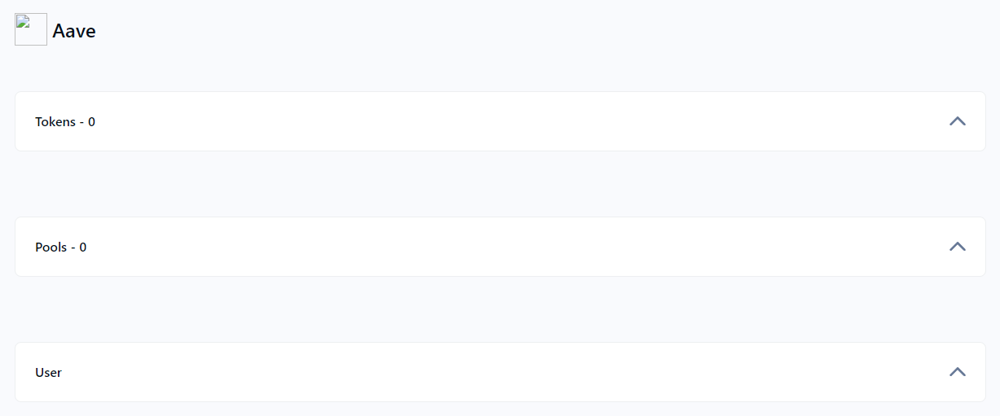

# Rekt Database

Striving to remain the biggest contributor to the safety of the DeFi community, DeFiYield has developed a most comprehensive database of all exploits, attacks, exit scams and other instances of projects getting 'rekt'. Our [**Rekt Database**](https://defiyield.app/rekt-database) offers a way to quickly search through these.

<figure><figcaption></figcaption></figure>

## Exploit Search

Through our Rekt Database, you can search for any project to find out if it has been exploited, rugged or has experienced any other sort of worrisome occurrence. By default, the page shows you the ranking of the exploits with the most financial impact (most funds lost).


By clicking on the 'Details' column next to any project, you can view a detailed summary of each occurrence, including the affected addresses, how the event took place, etc.


Search by chain, category, type of exploit/hack, name of project, date or even for the company that audited the affected contracts:

<figure><figcaption></figcaption></figure>
