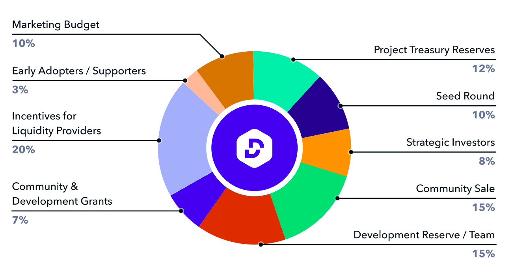

# DEFI Token


The DeFiYield Chain is still under development. Information on this page may change.


The DEFI token is the DeFiYield Chain's native token, as well as a governance token present on many other blockchains. With this token, users can take part in our chain, provide their vote on any governance proposals submitted by our community, as well as benefit from other exclusive features within our platform.

The token has a maximum supply of 1 Billion, and is deployed onto the following blockchains:

* **Ethereum:** _Not Yet Deployed_
* **BSC:** _Not Yet Deployed_
* **Polygon:** _Not Yet Deployed_
* **Avalanche:** _Not Yet Deployed_

## Token Utility

The DEFI token provides the following utility to its holders and the DeFiYield community:

* **Governance Voting** - Through DEFI, anyone can have voting power that allows you to share your opinions and preferences when it comes to any of our [**governance proposals**](governance.md).
* **Product Access** - DEFI holders have full access to any of DeFiYield's products, such as our [**audit database**](../audits/audit-database.md), [**Rekt database**](../audits/rekt-database.md), [**approvals page**](../security-toolkit/shield.md) and [**smart contract scanner**](../security-toolkit/scanner.md).
* **App Discounts** - DEFI holders have discounts when utilizing any DeFiYield services, such as our multi-harvesting service.
* **Becoming An Indexer** - In order to become an [**indexer**](infrastructure.md#indexers) in the DeFiYield Chain, one must stake DEFI for a certain length of time.
* **DeFiYield Chain Contract Queries** - In order to [**request smart contract data**](infrastructure.md#queries) from the DeFiYield Chain, one must spend some DEFI for each query.
* **Exclusive Chat Access** - DEFI holders have access to some of our internal channels, where our most committed community members can chat with our team at a more intimate level.
* **Partner Benefits** - The DEFI token can be used at any of our partners' liquidity pools or otherwise any other related DEFI token staking options available.
* **Stablecoin Collateralization** - The DEFI token can be used as collateral to mint DeFiYield's stablecoin, defiUSD.

## Token Distribution

## How To Earn DEFI

Other than buying DEFI on the open and decentralized market, one can earn DEFI by any of the following activities:

* Becoming an Indexer on the DeFiYield Chain.
* Delegating DEFI on the DeFiYield Chain.
* Contributing to our code scanning codebase.
* Providing liquidity for DEFI pools.
