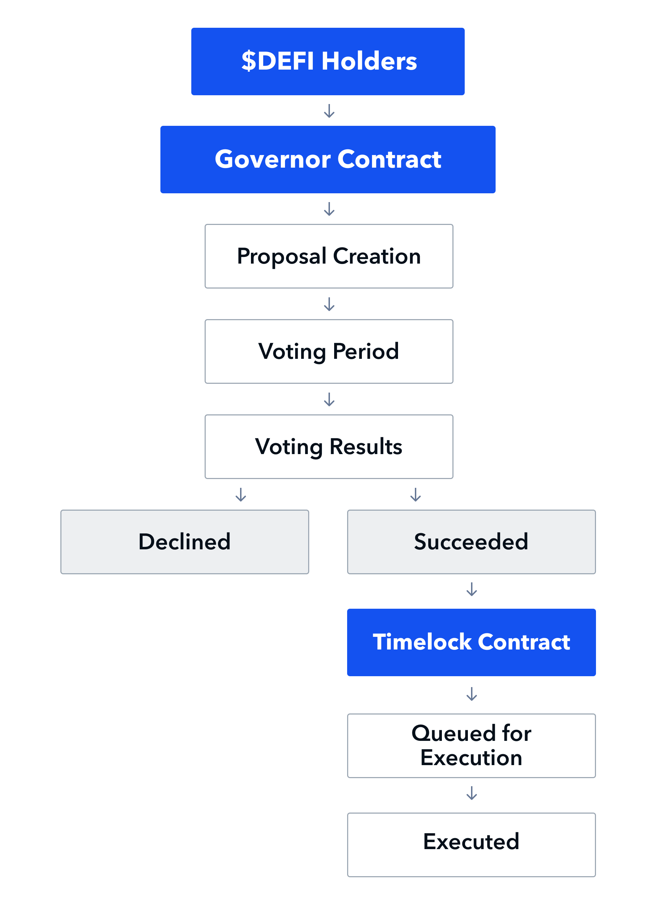

# Governance


The DeFiYield Chain is still under development. Information on this page may change.


Through our governance systems, users can propose anything from miscellaneous changes, feature requests or even redefining any of DeFiYield's underlying mechanisms. When voting, users have an option to vote for, against, or abstain from voting on any given proposal.

## Voting Process

